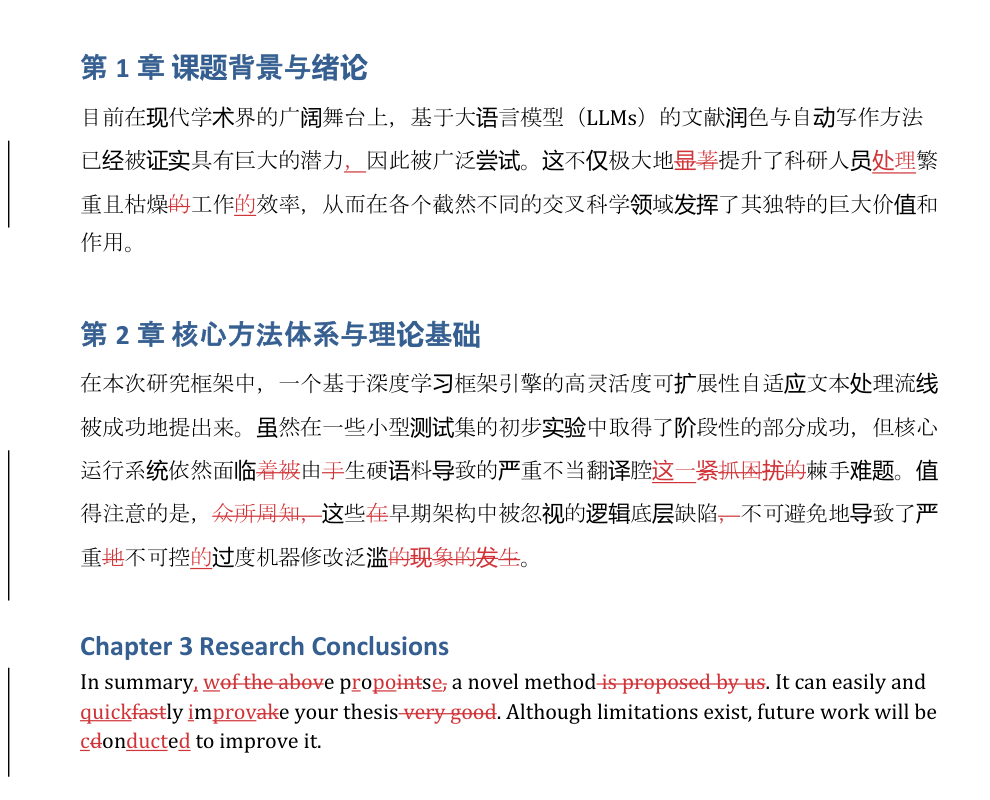

# AI Thesis Polisher · 论文逐句润色

把论文丢进去，拿到一份**带 Word 原生修订痕迹**的文档——每一处改动你都能看见、能逐条接受或拒绝。

> A Windows desktop tool that polishes academic papers and writes every suggestion back as
> native Microsoft Word tracked changes, so the author reviews and accepts them one by one.
> Interface and documentation are in Chinese.



*上图是本仓库 `demo_paper.docx` 的真实运行结果：删除带删除线、插入带下划线、左边距有改动条。*

## 和"AI 一键润色"有什么不同

大多数工具给你一份改完的新稿。你看不出它动了哪里、为什么动，也不敢直接交上去——尤其当它悄悄改了你的数据、单位或者引用。

这个工具反过来：

- **改动是 Word 的修订痕迹**，不是覆盖。你在 Word 里逐条决定接受还是拒绝
- **每一处都有理由**，输出一份逐句 Excel：原句、为什么改、改前、改后、状态
- **改不动的地方就明说**。校验没过、模型超时、格式复杂——报表里写清楚原因，不会伪装成"这句无需修改"

## 你需要什么

| | |
|---|---|
| 操作系统 | **Windows**（修订痕迹靠 Word COM 接口写入） |
| Word | **桌面版 Microsoft Word**。网页版 Word、WPS、LibreOffice **都不行** |
| Python | 3.8 以上 |
| 模型 | 任何兼容 OpenAI Chat Completions 的接口：DeepSeek、硅基流动、OpenAI、各类中转站都可以 |

**macOS / Linux 用户请止步**——没有桌面版 Word 的 COM 接口，这个工具跑不起来。界面在启动时会自检并告诉你缺什么。

## 三步开始

1. 双击项目根目录的 `start.bat`。它会自己建虚拟环境、装依赖、打开界面
2. 左侧填 `Base URL`、`API Key`、`Model`，点保存
3. 上传 `.docx`，点"开始一键润色"

**上传前请把这个文档在 Word 里关掉**，否则解析会失败。

手动启动：

```powershell
python -m venv venv
venv\Scripts\activate
pip install -r requirements.txt
streamlit run ui/app.py
```

## 你会得到什么

每次运行在输出目录下新建一个时间戳文件夹：

```text
outputs/
  20260906_201530_我的论文_a1b2c3d4/
    Polished_我的论文.docx     带修订痕迹，在 Word 里逐条审阅
    Report_我的论文.xlsx       按章节分表的逐句明细
    Run.json                   这次实际调了哪些模型、多少次、耗时与 token
    ChapterMemory.json         章节记忆的原文出处，以及被丢弃的条目
```

Excel 每行一个句子：段落号、句子、原句 (旧)、润色理由、修改片段(原)、修改片段(改)、润色后完整句、状态、优先级。

状态是明确区分的，失败不会混进"无需修改"：

| 状态 | 含义 |
|---|---|
| `EDIT_WRITTEN` | 已写入 Word 修订 |
| `KEEP` | 模型判断这句不用改 |
| `REVIEW_REJECTED` | 复审阶段否决了这条建议 |
| `VALIDATION_REJECTED` | 写回前的规则校验拦下（改动了数字、引用之类） |
| `PATCH_FAILED` | 写回 Word 失败，已撤销，原文未变 |
| `SKIPPED_UNSUPPORTED` | 段落有已存在的修订、表格或复杂结构，整段跳过 |
| `MODEL_TIMEOUT` / `MODEL_HTTP_ERROR` / `MODEL_FORMAT_ERROR` | 模型请求失败或输出不合契约 |
| `MEMORY_VALIDATION_ERROR` | 该章节的记忆无法通过出处校验，本章未处理 |
| `RUN_ABORTED` | 回滚无法确认，整次运行作废且不保存 |

## 它怎么改

三个阶段，逐段处理，不把整篇论文一次性喂给模型：

1. **章节理解**——按章节挑出原文里的关键术语和重要句子的**编号**。模型只能选，不能自己写摘要；引文、位置、偏移全由程序从原文补齐，选了原文里不存在的东西会被丢弃并记录
2. **逐句提名**——带着章节记忆和前后文，对每句给出完整修订句或"保持不变"
3. **保守复审**——第二次判断，驳回没有实质提升的改写、误伤术语的改写、不该动的被动句

写回 Word 之前还有一层**确定性校验**（规则，不是模型）：比对数字、常见单位、引用、缩写和部分化学式的内容、数量与顺序，不一致就拒绝这条修改。每段是一个独立的撤销事务，写完当场核对文本，对不上就整段撤销；连撤销都无法确认时，整次运行不保存。

## 它明确不做什么

- **不判断科学事实。** 校验器是规则，不是事实核查，不能保证技术内容零误伤
- **不动数字、单位、引用、缩写、情态词**（could / may / must）和正常的实验被动句
- **不碰复杂结构。** 已有修订痕迹、表格、公式、脚注、内容控件所在的段落直接跳过，报表里给出原因
- **不自动接受你已有的修订。** 文档里若已有修订痕迹，请先在 Word 里处理干净
- **不适合多进程同时跑。** 缓存是本地单进程的
- **论文内容会发送给你配置的模型接口。** API Key 只保存在本机 `user_config.json`

## 界面上的选项

| 选项 | 说明 |
|---|---|
| 论文主体语言 | 纯中文 / 纯英文 / 中英混合。决定哪些段落会被当成"非正文"跳过 |
| 润色强度 | 轻度（只纠错别字和基础语病）/ 标准（优化学术表达）/ 重度（重写不通顺长句） |
| 最小段落长度 | 低于此字数的段落（图注、短标题）直接跳过 |
| 复审模式 | 不复审（最省）/ 同模型复审（默认）/ 独立模型复审 |
| 分阶段模型配置 | 章节理解、编辑、复审分别指定模型、接口、温度、超时、重试 |
| 每次编辑调用打包的段落数 | 默认 1。调大可省约七成请求，代价见下 |
| 跳过章节 | 勾掉参考文献、致谢之类不需要润色的章节 |
| 明确保护术语 | 每行一个，这些词不会被改动 |
| Prompt 自定义 | 三个阶段各可追加一段要求，**追加**在内置约束之后，不替换 |

关于**打包**：把同一章的连续段落合并成一次请求，实测省约 70% 请求、25%–31% token。代价是模型的判断偏好会轻微改变——语法错误抓得更稳，啰嗦句子更容易漏掉。因为有代价，默认关着，由你决定。详见 [打包实测记录](benchmarks/PACKING.md)。

## 常见问题

**为什么解析 Word 失败？** 十有八九是文档还在 Word 里开着，或者被同步盘占用。关掉再试。

**为什么有些段落一个字没改？** 可能是真的不需要改，也可能是被跳过或被校验拦下了。**看 Excel 报表**，每一种情况都有对应状态和原因。

**能不能用本地模型？** 只要提供兼容 OpenAI Chat Completions 的接口就行。本机地址（localhost）允许 HTTP，其他远程地址默认要求 HTTPS。

**一篇论文要多少钱？** 取决于篇幅和模型。每次运行的 `Run.json` 里有实际请求数和 token 用量，先拿一章试跑。

**中断了怎么办？** 从原始文档重新运行。已保存的建议会被复用，不会重复调用模型；程序不会在半成品上继续写。

## 开发与测试

```powershell
python -m unittest discover -s . -p "test_*.py"
```

依赖真实 Word 的测试会在没有 Word 的机器上自动跳过，CI 跑的是同一条命令。

```text
engine/
  document.py          Word 读取、章节解析、修订写入
  sentences.py         无损分句与 Word 位置映射
  patches.py           确定性差异计算
  validation.py        数字/单位/引用等保护规则
  revision_contract.py 模型输出的严格契约
  chapter_memory.py    章节记忆：只选原文，不自由生成
  sentence_pipeline.py 主流程
  stage_models.py      分阶段模型路由与凭据绑定
  environment.py       启动前的运行环境自检
ui/
  app.py               Streamlit 界面
benchmarks/            离线评测与实测记录
```

## 验证记录

这些文档记录了每项改动**实测了什么、边界在哪**，包含失败的和被推翻的结论：

- [P0 可靠性验证](benchmarks/VALIDATION.md) · [P1 句子定位与安全写回](benchmarks/P1_VALIDATION.md)
- [章节记忆](benchmarks/MEMORY_VALIDATION.md) · [记忆失败半径](benchmarks/MEMORY_SALVAGE.md)
- [分阶段模型与独立复审](benchmarks/REVIEW_VALIDATION.md)
- [成本基线](benchmarks/COST_BASELINE.md) · [段落打包](benchmarks/PACKING.md) · [批量筛选：实测后决定不启用](benchmarks/TRIAGE.md)
- [离线评测语料与方法](benchmarks/README.md) · [公开语料来源与许可](benchmarks/SOURCES.md)

评测语料是合成的、由 Agent 标注的，**不冒充人工接受率**，也不是真实论文自然错误的代表性质量评测。

## License

MIT
